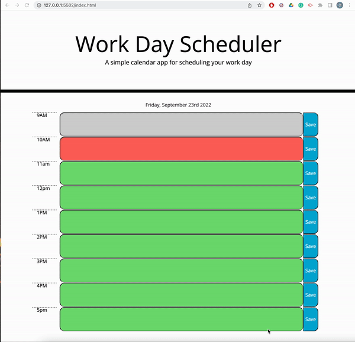

# Work-Day-Scheduler

## Description
This is a tool to view one's schedule for the current day. It also allows user to input their own events into each timeblock.
## Installation 
N/A

## Usage
The items within in schedule will change color based upon time. If it is gray that means the time block has passed, if it is red that is the current time block and if its green that means the time block has yet to occur. Users can also save their events and it will be there when they reload the page

## Credits
https://stackoverflow.com/questions/195951/how-can-i-change-an-elements-class-with-javascript
Used this is switch classed based upon time

https://stackoverflow.com/questions/59995703/trying-to-change-background-color-based-off-if-the-hour-is-in-the-past-current
Logic inspired by the answer posted by user "Cat"

## License
N/A

## Link to Application
[Link to Application](https://cgordon5025.github.io/Work-Day-Scheduler/)